# HSLU RIS – Normalisiertes Analytics-Datenmodell

Erzeugt von `etl/build_clean_model.py`. Rohdaten unter `data/raw/` werden nie verändert;
alle Outputs (`data/staging`, `data/dimensions`, `data/facts`, `data/bridges`, `data/audit`,
`data/duckdb/hslu_ris.duckdb`) werden bei jedem Lauf vollständig aus den Rohdaten neu erzeugt.

Zusätzlich (separat, da nicht Teil der ursprünglichen vier Kern-Dateien): `etl/build_zone_parameters.py`
ergänzt `dim_zone_parameter` und `stg_project_zone_parameters` aus `data_hslu260312.csv` (3.5 GB,
projektgranular, ein Detaillevel unter `project_level.csv`).

## Mermaid ERD

```mermaid
erDiagram
    dim_canton ||--o{ dim_municipality : "1 zu n"
    dim_municipality ||--o{ dim_municipality_part : "1 zu n"
    dim_municipality ||--o| fact_municipality : "1 zu 1"
    dim_municipality ||--o| fact_ranking : "1 zu 1"
    dim_municipality ||--o{ fact_regulation : "1 zu n"
    dim_municipality ||--o{ fact_project : "1 zu n (via BFS)"
    dim_municipality ||--o{ bridge_municipality_law : "1 zu n"
    dim_municipality_part ||--o{ bridge_municipality_law : "1 zu n (optional)"
    dim_law_document ||--o{ dim_document_version : "1 zu n"
    dim_document_version ||--o{ bridge_municipality_law : "1 zu n"
    dim_document_version ||--o{ fact_document_validation : "1 zu n"
    dim_document_version ||--o| fact_regulation : "1 zu 1 (aktuelle Version)"
    fact_project ||--o{ bridge_project_fsa : "1 zu n"
    fact_project ||--o{ bridge_project_devtype : "1 zu n"
    fact_project ||--o{ bridge_project_zone : "1 zu n (aktuell leer)"
    dim_fsa ||--o{ bridge_project_fsa : "1 zu n"
    dim_devtype ||--o{ bridge_project_devtype : "1 zu n"
    dim_zone ||--o{ bridge_project_zone : "1 zu n (aktuell leer)"
    dim_municipality ||--o{ dim_zone : "1 zu n (aktuell leer)"
    dim_municipality ||--o{ dim_zone_parameter : "1 zu n (BFS + Zone)"

    dim_canton {
        int canton_id PK
        varchar canton_code UK
        varchar canton_name
    }
    dim_municipality {
        int municipality_id PK
        int bfs_number UK
        varchar municipality_name
        int canton_id FK
    }
    dim_municipality_part {
        int municipality_part_id PK
        int municipality_id FK
        varchar municipality_part_name
    }
    dim_zone {
        int zone_id PK
        int municipality_id FK
        varchar zone_name
        double zone_area_m2
        varchar zone_geometry
    }
    dim_fsa {
        int fsa_code PK
        varchar fsa_description
    }
    dim_devtype {
        int devtype_code PK
        varchar devtype_description
    }
    dim_law_document {
        varchar law_document_id PK
        varchar canonical_url
        varchar source_system
        timestamp first_seen_at
        timestamp last_seen_at
    }
    dim_document_version {
        varchar document_version_id PK
        varchar law_document_id FK
        varchar source_version
        varchar original_creation_date
        varchar original_modification_date
        varchar original_author
        bigint original_file_size
        varchar downloaded_creation_date
        varchar downloaded_modification_date
        varchar downloaded_author
        bigint downloaded_file_size
        varchar original_metadata_raw
        varchar downloaded_metadata_raw
    }
    fact_project {
        bigint PROJID PK
        int BFS FK
        bigint EGID
        date applied_date
        date approved_date
        double processing_days
        double apartments
        double storeys
        double floorarea
        double volume
        varchar project_name
        varchar town
    }
    fact_municipality {
        int municipality_id PK
        double n_projects
        double mean_duration
        double median_duration
        double sd_duration
        double share_gt_180
        double share_gt_365
        double complexity_index_raw
        double build_density
    }
    fact_ranking {
        int municipality_id PK
        double peer_rank
        double process_score
        double regulation_score
        double market_score
        double overall_score
    }
    fact_regulation {
        int municipality_id FK
        int municipality_part_id FK
        varchar document_version_id FK
        double complexity_index_raw
        double intervention_count
        double architecture_count
        double housing_count
        double densification_count
        double document_age
    }
    fact_document_validation {
        int validation_id PK
        varchar document_version_id FK
        int municipality_id FK
        int municipality_part_id FK
        boolean linkdoc_present
        boolean downloaded_pdf_valid
        boolean municipality_exists
        boolean link_valid
        boolean metadata_equal
        boolean hash_equal
        boolean crawled_link_same
        varchar crawled_link
        varchar validation_status
    }
    bridge_project_fsa {
        bigint PROJID FK
        int FSA_CODE FK
        int POSITION
        boolean IS_PRIMARY
    }
    bridge_project_devtype {
        bigint PROJID FK
        int DEVTYPE FK
        int POSITION
        boolean IS_PRIMARY
    }
    bridge_project_zone {
        bigint PROJID FK
        int ZONE_ID FK
    }
    bridge_municipality_law {
        int municipality_law_id PK
        int municipality_id FK
        int municipality_part_id FK
        varchar law_document_id FK
        varchar document_version_id FK
    }
    dim_zone_parameter {
        int zone_parameter_id PK
        int BFS FK
        varchar zone_clean UK
        varchar zone_name
        int n_source_projects
        varchar grenzabstand_standard_value "... 162 weitere Parameter-Spalten (27 Typen x 3 Varianten x 2)"
    }
```

## Business-Definitionen

- **dim_municipality**: Eine Zeile pro Schweizer Gemeinde (BFS-Nummer). Universum ist die Vereinigung
  aller BFS/GDENR-Werte aus `project_level.csv`, `municipality_level.csv`, dem HSLU-Ranking, den
  Gemeinde-Koordinaten und `results_law_Manager`. Name/Kanton werden in dieser Priorität aufgelöst:
  Ranking-Sheet `Gemeindedaten` → `gemeinden_koordinaten.xlsx` → `results_law_Manager` (GDENAME/GDEKT).
- **dim_municipality_part**: Ortsteile (`GDETEIL`) aus `results_law_Manager`. Nur nicht-leere Werte
  werden als Zeile angelegt; leere GDETEIL bleibt `NULL` (keine künstliche "Hauptgemeinde").
- **dim_zone**: Schema angelegt, aktuell **0 Zeilen** – siehe "Offene Risiken".
- **dim_fsa / dim_devtype**: Codetabellen aus `fsa_lu.csv` / `devtype_lu.csv`. Diese Dateien sind
  cp1252-kodiert; sie werden explizit mit dieser Kodierung gelesen (siehe Qualitätsregeln).
- **dim_law_document**: Eine Zeile pro eindeutiger, normalisierter Dokument-URL aus
  `results_law_Manager`. `law_document_id = SHA256(normalized_url)`, wobei `normalized_url =
  trim(LINKDOC).lower()`. Zeilen ohne LINKDOC erzeugen kein Dokument (8 von 1488 Zeilen).
- **dim_document_version**: Eine Zeile pro (Dokument, VERSION-Snapshot). `document_version_id =
  SHA256(law_document_id + '|' + source_version)`. `original_*`/`downloaded_*` werden per Regex aus
  `METADATA_ORIGINAL`/`METADATA_DOWNLOADEDFILE` extrahiert (Schreibweise `modifcationDate`
  übernommen); die Rohstrings bleiben vollständig in `original_metadata_raw` /
  `downloaded_metadata_raw` erhalten.
- **fact_project**: Eine Zeile pro `PROJID` aus `project_level.csv`. `apartments`, `storeys`,
  `floorarea`, `volume`, `project_name`, `town` existieren **nicht** in der aktuellen Rohdatenquelle
  und sind daher strukturell `NULL` (Schema bleibt vorwärtskompatibel). Die vollständigen
  Rohdaten (inkl. Tenure, Devtype, FSA, Zone-Fläche, Nachhaltigkeits-Kennzahlen) bleiben zusätzlich
  1:1 in `data/staging/stg_project.parquet` erhalten – keine Information geht verloren.
- **fact_municipality**: `n_projects`, `mean/median/sd_duration`, `share_gt_180/365` stammen aus dem
  Ranking-Sheet `Gemeindedaten` (Zeitraum 2021–2024, siehe Feld `n_projects_2021_2024`).
  `complexity_index_raw`/`build_density` stammen aus `municipality_level.csv` (alle Jahre).
- **fact_ranking**: 1:1 aus dem Ranking-Sheet `Ranking`. `regulation_score` = `score_reglement_complexity`
  (kein Feld namens `score_regulierung` existiert im Ranking-Sheet selbst, nur im Scores-Sheet).
- **fact_regulation**: Granularität ist **Gemeinde**, nicht Dokumentversion – siehe "Offene Risiken".
  `document_version_id` verweist auf die jeweils aktuellste (höchste `VERSION`) Gemeinde-weite
  Dokumentversion aus `bridge_municipality_law`.
- **fact_document_validation**: Eine Zeile pro Zeile in `results_law_Manager` (1488 Zeilen, keine
  verloren). `validation_status` wird deterministisch klassifiziert (siehe Qualitätsregeln).
- **dim_zone_parameter**: Eine Zeile pro eindeutiger Kombination (`BFS`, `zone_clean`) aus
  `data_hslu260312.csv`. Enthält 27 Zonenparameter-Typen (Ausnützungsziffer, Gebäudehöhe,
  Grenzabstand, Geschosse, Wohnanteil usw.), je mit Standard-/Bonus-/Arealüberbauung-Variante und
  zugehörigem `[T/N]`-Flag (168 Wertespalten total). Werte bleiben als Rohtext erhalten (z. B.
  `"≥4"`, `"10; 7"`) statt in Zahlen geparst zu werden – einzelne Zellen enthalten Mehrfachwerte
  oder Vergleichsoperatoren, eine numerische Vereinfachung würde reale regulatorische Nuancen
  verlieren. Aggregation über `any_value()` je Gemeinde+Zone (Werte sind Reglementskonstanten und
  stimmen zwischen Projekten derselben Zone überein); `n_source_projects` zeigt, auf wie vielen
  Projekt-Zeilen die Aggregation basiert. Wird von der Parzellen-Seite (`pages/parzellen.py`)
  per Fuzzy-Match auf den von geodienste.ch/ch.are.bauzonen gelieferten Zonennamen abgefragt.

## Datenherkunft (Lineage)

| Zieltabelle | Rohquelle(n) |
|---|---|
| dim_municipality, dim_canton | HSLU_Gemeinderanking (Gemeindedaten), gemeinden_koordinaten.xlsx, results_law_Manager, project_level.csv, municipality_level.csv |
| dim_municipality_part | results_law_Manager (GDETEIL) |
| dim_fsa | fsa_lu.csv (cp1252) |
| dim_devtype | devtype_lu.csv (cp1252) |
| dim_law_document, dim_document_version | results_law_Manager (LINKDOC, VERSION, METADATA_*) |
| fact_project | project_level.csv |
| fact_municipality | HSLU_Gemeinderanking (Gemeindedaten), municipality_level.csv |
| fact_ranking | HSLU_Gemeinderanking (Ranking) |
| fact_regulation | HSLU_Gemeinderanking (Gemeindedaten), municipality_level.csv, bridge_municipality_law |
| fact_document_validation | results_law_Manager (alle Validierungsfelder) |
| bridge_project_fsa | project_level.csv (FSACODE_1..12) |
| bridge_project_devtype | project_level.csv (DEVTYPE_1 – nur 1 Slot vorhanden) |
| bridge_municipality_law | results_law_Manager |
| dim_zone, bridge_project_zone | keine – siehe "Offene Risiken" |
| stg_tenure_lu, stg_cs_code_lu | tenure_lu.csv, cs_code_lu.csv – gestaged, aber nicht in Fakten verwendet (siehe Risiken) |
| dim_zone_parameter, stg_project_zone_parameters | data_hslu260312.csv (separates Skript `etl/build_zone_parameters.py`) |

## Qualitätsregeln

1. **cp1252 statt UTF-8 für Lookup-CSVs**: `fsa_lu.csv`, `devtype_lu.csv`, `tenure_lu.csv`,
   `cs_code_lu.csv` sind cp1252-kodiert. Die alte Pipeline (`etl/build_database.py`, UTF-8 +
   `ignore_errors=true`) hat dadurch **jede Zeile mit Umlaut silently gelöscht**: `fsa_lu` verlor
   91 von 203 Zeilen (45%), `cs_code_lu` 34 von 129 (26%). `build_clean_model.py` liest diese
   Dateien explizit mit `encoding='cp1252'` – 0 Zeilen Verlust.
2. **results_law_Manager ist ';'-getrennt, aber nicht CSV-sauber**: Freitext-Autorenfelder in
   `METADATA_ORIGINAL`/`METADATA_DOWNLOADEDFILE` (z. B. `author: Elsbeth Bott; Martin Fopp`) und
   einzelne `LINKDOC`-URLs enthalten unescapte `;`. Ein naiver Positions-Split verschiebt dadurch
   nachfolgende Spalten. `build_clean_model.py` verankert stattdessen auf den 5 literalen
   `True`/`False`-Flags (`LINKDOC_PRESENT..METADATA_EQUAL`) und den 3 Flags am Zeilenende
   (`HASH_EQUAL, CRAWLED_LINK, CRAWLED_LINK_SAME`); alles dazwischen wird verlustfrei
   rekonstruiert. Betroffene/reparierte Zeilen stehen in `audit/law_document_issues.csv`.
3. **`HASH_EQUAL=False` ist kein Fehler**: wird als `CONTENT_CHANGED` klassifiziert (informativ),
   nicht als ungültig.
4. **`CRAWLED_LINK_SAME=False` ist im aktuellen Snapshot kein Redirect-Signal**: `CRAWLED_LINK` ist
   in allen 1488 Zeilen leer; `CRAWLED_LINK_SAME=False` ist hier der Default-Platzhalter "kein
   Vergleich durchgeführt", nicht "Redirect erkannt". `CRAWLER_REDIRECT` wird daher nur vergeben,
   wenn `CRAWLED_LINK` tatsächlich einen Wert hat und dieser vom LINKDOC abweicht.
5. **validation_status-Priorität** (erste zutreffende Regel gewinnt):
   `MUNICIPALITY_MISMATCH` (municipality_exists=False) → `INVALID_LINK`
   (linkdoc_present=False oder link_valid=False) → `INVALID_PDF` (downloaded_pdf_valid=False) →
   `CRAWLER_REDIRECT` (crawled_link vorhanden und crawled_link_same=False) → `CONTENT_CHANGED`
   (hash_equal=False) → `METADATA_CHANGED` (metadata_equal=False) → `REVIEW_REQUIRED`
   (irgendein Kernfeld NULL) → `VALID`.
6. **Keine Dubletten löschen**: mehrere Gemeinden/Ortsteile dürfen dasselbe `law_document_id`
   referenzieren (`bridge_municipality_law`); das wird explizit nicht dedupliziert, sondern in
   `audit/document_version_conflicts.csv` als `document_shared_across_municipalities` ausgewiesen.
7. **Deduplizierung project_level.csv**: 0 doppelte `PROJID`, 0 exakt identische Zeilen gefunden
   (bestätigt in `audit/duplicate_register.csv`).
8. **data_hslu260312.csv braucht `max_line_size`**: mindestens eine Zeile enthält eine sehr
   detaillierte Polygon-Geometrie (`zone_geom`, WKT) über 2 MB Länge, was DuckDBs Standardlimit
   von 2'000'000 Bytes überschreitet. `build_zone_parameters.py` setzt `max_line_size=50000000`.
9. **geodienste.ch verlangt seit einem API-Update einen `crs`-Parameter**: Ohne
   `crs=http://www.opengis.net/def/crs/EPSG/0/2056` antwortet die OGC-API-Features-Schnittstelle
   mit `403 Forbidden`. Da dieser Fehler in `pages/parzellen.py` als generische
   `RequestException` abgefangen wurde, ist die primäre Zonenabfrage (geodienste.ch, mit
   Dokumenten/Überlagerungen) bislang **immer** stillschweigend auf den generischen
   `ch.are.bauzonen`-Fallback zurückgefallen. Behoben durch Ergänzen des `crs`-Parameters.

## Offene Risiken

- **fact_project**: `apartments`, `storeys`, `floorarea`, `volume`, `project_name`, `town` sind in
  `project_level.csv` nicht (mehr) vorhanden und daher strukturell `NULL`. Klären, ob dieser Export
  reduziert wurde oder ob eine vollständigere Quelle existiert.
- **dim_zone / bridge_project_zone**: keine Quelle für `zone_name` oder `zone_geometry` vorhanden
  (das frühere Feld `typ_kommunal_bezeichnung` existiert nicht mehr in `project_level.csv`, und es
  gibt keine Zonen-Geometriedatei). Beide Tabellen sind strukturell angelegt, aber leer.
- **fact_regulation-Granularität**: `Intervention_count`, `Architektur_count`, `Wohnen_count`,
  `Verdichtung_count`, `document_age` liegen im HSLU-Ranking nur pro Gemeinde vor, nicht pro
  Dokumentversion. `fact_regulation` hat daher Gemeinde-Granularität (`municipality_part_id` immer
  `NULL`) mit einem Verweis auf die jeweils aktuellste Dokumentversion, nicht eine echte
  1:1-Zuordnung Kennzahl↔Version.
- **`CRAWLED_LINK` nie befüllt**: Die `CRAWLER_REDIRECT`-Logik ist implementiert, greift aber im
  aktuellen Snapshot nie, weil das Quellfeld durchgängig leer ist.
- **dim_law_document `first_seen_at`/`last_seen_at`**: Es gibt nur einen Crawl-Snapshot
  (`VERSION=20240511` für praktisch alle Zeilen), daher sind beide Felder aktuell identisch. Erst
  bei mehreren Snapshots über Zeit wird dieses Feld aussagekräftig.
- **`tenure_lu`/`cs_code_lu`**: korrekt gestaged (cp1252-Fix), aber ohne Verwendung in einer
  Dimension/Bridge, da `project_level.csv` keine `CS_CODE_*`-Spalten mehr enthält und keine
  `dim_tenure`/`dim_cs_code` im Zielmodell angefordert wurde.
- **bridge_project_devtype**: `project_level.csv` enthält nur `DEVTYPE_1` (kein `DEVTYPE_2..12`),
  daher hat jedes Projekt genau einen Devtype-Eintrag statt bis zu 12.
- **dim_zone_parameter – Zonennamen-Matching ist Fuzzy, kein garantierter Schlüssel**: Die
  Parzellen-Seite matcht den von geodienste.ch/ch.are.bauzonen gelieferten Zonennamen
  (`zone_kommunal`/`zone_detail`/`zone_category`) gegen `zone_clean` aus `data_hslu260312.csv` -
  zwei unterschiedliche Vokabulare/Quellen. Exakter Match zuerst, sonst Substring-Fallback; bei
  mehrdeutigen Treffern wird die erste Zeile verwendet. Kein Anspruch auf 100%ige Trefferquote
  über alle Gemeinden.
- **dim_zone_parameter – keine Geometrie**: Die Zuordnung erfolgt über den Zonennamen, nicht über
  eine räumliche Prüfung, ob der geklickte Punkt tatsächlich innerhalb der Zonenparameter-Quelle
  liegt (dafür bräuchte es `zone_geom` aus `data_hslu260312.csv`, aktuell nicht extrahiert).
